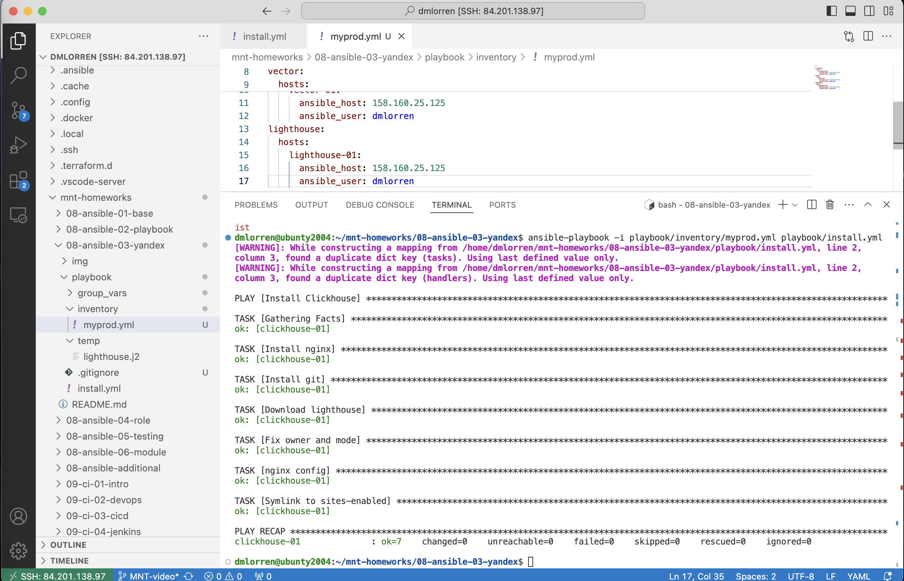

# Домашнее задание к занятию 3 «Использование Ansible» - Иванов Дмитрий (fops-13)

## Подготовка к выполнению

1. Подготовьте в Yandex Cloud три хоста: для `clickhouse`, для `vector` и для `lighthouse`.
2. Репозиторий LightHouse находится [по ссылке](https://github.com/VKCOM/lighthouse).

## Основная часть

1. Допишите playbook: нужно сделать ещё один play, который устанавливает и настраивает LightHouse.
2. При создании tasks рекомендую использовать модули: `get_url`, `template`, `yum`, `apt`.
3. Tasks должны: скачать статику LightHouse, установить Nginx или любой другой веб-сервер, настроить его конфиг для открытия LightHouse, запустить веб-сервер.
4. Подготовьте свой inventory-файл `prod.yml`.
5. Запустите `ansible-lint site.yml` и исправьте ошибки, если они есть.
6. Попробуйте запустить playbook на этом окружении с флагом `--check`.
7. Запустите playbook на `prod.yml` окружении с флагом `--diff`. Убедитесь, что изменения на системе произведены.
8. Повторно запустите playbook с флагом `--diff` и убедитесь, что playbook идемпотентен.
9. Подготовьте README.md-файл по своему playbook. В нём должно быть описано: что делает playbook, какие у него есть параметры и теги.
10. Готовый playbook выложите в свой репозиторий, поставьте тег `08-ansible-03-yandex` на фиксирующий коммит, в ответ предоставьте ссылку на него.

---

## Решение задачи 1

### Итоговый резльтат:


пример команды запуска:
```bash
ansible-playbook -i playbook/inventory/myprod.yml playbook/install.yml 
```

- Для работы был взят плейбук из предыдущего задания и доработан под поставленные задачи из этого упражния.
- Конфигурирование выполнялось в yandex cloud, под установку clickhouse и vector, lighthouse, nginx поднята дополнительная vm на debian (c vm1 (ansible) на vm2 проброшен id_rsa.pub в ~/.ssh/authorized_keys).

### Краткое резюме задач
**Get clickhouse distrib**: Скачивает пакеты ClickHouse.
**Install clickhouse packages** Устанавливает пакеты ClickHouse и перезапускает сервис.
**Get Vector**: Скачивает пакет Vector.
**Install Vector**: Устанавливает пакет Vector и перезапускает сервис.
**Flush handlers**: Немедленно запускает все уведомленные хендлеры.
**Create database**: Создает базу данных logs в ClickHouse.
**Install nginx**: Устанавливает веб-сервер nginx.
**Install git**: Устанавливает утилиту git (иначе не сможем скачать lighthouse).
**Download lighthouse**: Клонирует репозиторий Lighthouse.
**Fix owner and mode**: Устанавливает права доступа для директории Lighthouse.
**nginx config**: Копирует конфигурационный файл nginx для Lighthouse.
**Symlink to sites-enabled**: Создает символическую ссылку на конфигурационный файл и перезапускает сервис nginx.

---
