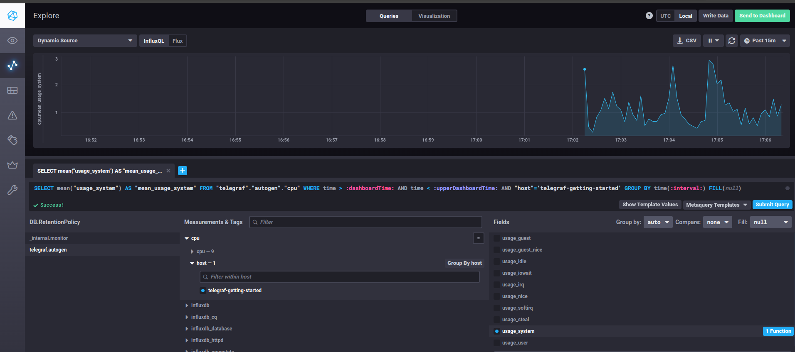
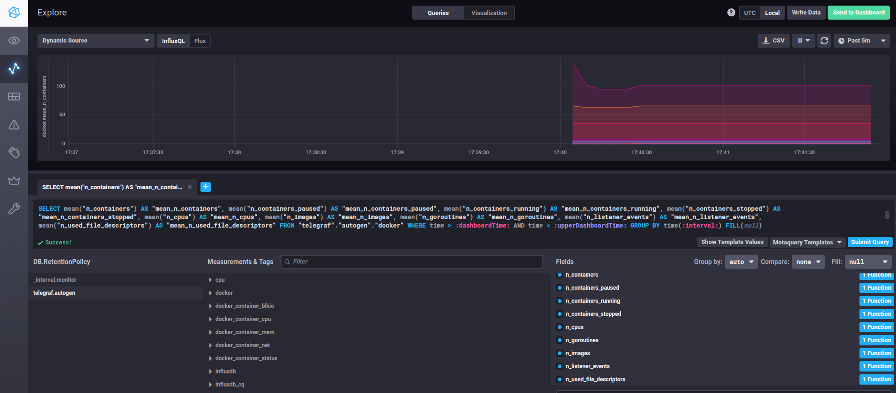

# Домашнее задание к занятию "13.Системы мониторинга" - Иванов Дмитрий (fops-13)

## Обязательные задания

1. Вас пригласили настроить мониторинг на проект. На онбординге вам рассказали, что проект представляет из себя 
платформу для вычислений с выдачей текстовых отчетов, которые сохраняются на диск. Взаимодействие с платформой 
осуществляется по протоколу http. Также вам отметили, что вычисления загружают ЦПУ. Какой минимальный набор метрик вы
выведите в мониторинг и почему?
#

### Ответ:

Для данного примера можно взять за стандарт следующие метрики:

1. Метрики CPU, например **CPU load average** - среднее значение загрузки системы (значение в нормальном состоянии находится в диапазоне от 0 до 1, единица соответствует 100% загрузке одноядерной системы без перегруза). Данная метрика позволяет следить за нагрузкой на процессоры и не перегружать систему избыточными отчетами;

2. Метрика **RAM** - для оценки свободной оперативной памяти системы.

3. Метрики жёстких дисков (SSD/HDD), здесь метрика оценки **FS** - количество свободного места на диске, так и **IOPS** - количество операций ввода/вывода (записи на диск), метрика позволяет отслеживать работоспособность оборудования (резкое повышение показателя IOPS может свидетельствовать о неисправности жестких дисков), а также метрика **inodes** - для оценки количества свободных дисковых дескрипторов;

4. Метрика **http_requests** - отслеживание количества входящих запросов на сервер рост запросов может свидетельствовать о проблемах с доступом по http, в результате которой вычислительная платформа может быть недоступна;

5. Дополнением к п. 4 послужит метрика **status_code_http** - мониторинг статусных кодов HTTP (например, 200, 404, 500) позволит отслеживать успешность или ошибки при обработке запросов. Это поможет выявить потенциальные проблемы, такие как внутренние ошибки сервера (500), проблемы с доступностью (404) или превышение времени ожидания (504).

6. Метрика времени отклика **response_time**  - измерение времени затраченное на обработку запросов и генерацию текстовых отчетов. С целью оценки производительности продукта и локализации возможных проблем.


#
2. Менеджер продукта посмотрев на ваши метрики сказал, что ему непонятно что такое RAM/inodes/CPUla. Также он сказал, 
что хочет понимать, насколько мы выполняем свои обязанности перед клиентами и какое качество обслуживания. Что вы 
можете ему предложить?

### Ответ:

Для оценки качества обслуживания можно предложить ввести в компании следующие подходы и метрики:

- Service Level Agreement, SLA - соглашение об уровне предоставления услуг, в котором компания обязуется предоставлять определенный уровень сервиса клиентам. Т.е что от нашей компании следует ожидать.

- Service-level objective, SLO - цель, которую компания устанавливает для себя, чтобы соответствовать SLA. Например, это может быть цель обрабатывать 99% запросов за определенное время.

- Service level indicator, SLI - метрика, которую компания использует для измерения производительности или качества своей системы. Например, это может быть метрика времени отклика или процент успешно обработанных запросов.

Резюмируя, с помощью SLA, SLO и SLI, можно дать оценку насколько компания успешно выполняет свои обязанности перед клиентами и какое качество обслуживания предоставляет.


#
3. Вашей DevOps команде в этом году не выделили финансирование на построение системы сбора логов. Разработчики в свою 
очередь хотят видеть все ошибки, которые выдают их приложения. Какое решение вы можете предпринять в этой ситуации, 
чтобы разработчики получали ошибки приложения?

### Ответ:

Довольно достаточно существует систем мониторинга в формате open-source, которые можно применить в компании.

1. Можно интегрировать Prometheus для автоматического сбора метрик производительности системы и ошибок приложений с целью их последующего анализа.
2. Можно интегрировать стек ELK, состоящий из следующих программных продуктов:
```
- Elasticsearch - NoSQL база данных документов в формате JSON;
- Kibana - инструмент по визуализации данных (информацию с логов можно отслеживать в виде таблиц и диаграмм), для разработчиков может быть удобно разбивать данные по типам неисправностей и по сервисам, на которых они возникают;
- Logstash - конвейер обработки данных на стороне сервера, который получает данные из нескольких источников одновременно, парсит лог, а затем отправляет в базу данных Elasticsearch (позволяет обработать "сырые" данные для более удобного их восприятия, например убрать лишние символы, пробелы, структурировать данные и т.д.);
- Filebeat — доставщик лог-сообщений. Принцип его работы состоит в мониторинге и сборе лог-сообщений из лог-файлов и пересылке их в elasticsearch или logstash (один источник данных, в нашем случае сервис или приложение - один filebeat).
```

#
4. Вы, как опытный SRE, сделали мониторинг, куда вывели отображения выполнения SLA=99% по http кодам ответов. 
Вычисляете этот параметр по следующей формуле: summ_2xx_requests/summ_all_requests. Данный параметр не поднимается выше 
70%, но при этом в вашей системе нет кодов ответа 5xx и 4xx. Где у вас ошибка?


### Ответ:

Ошибка в формуле вычесления. Так как нам интересны коды ответов 3хх и 2хх ответы, правильнее было бы сделать формулу:
```
(summ_2xx_requests + summ_3xx_requests)/(summ_all_requests)
```
Это будет процент всех ответов 3xx и 4xx

#
5. Опишите основные плюсы и минусы pull и push систем мониторинга.

### Ответ:
```
1. push системы имеют следующие преимущества:

- упрощение репликации данных в разные системы мониторинга или их резервные копии
- более гибкая настройка отправки пакетов данных с метриками
- UDP — это менее затратный способ передачи данных, из-за чего может возрасти производительность сбора метрик

2. pull системы имеют следующие преимущества:

- легче контролировать подлинность данных
- можно настроить единый proxy server до всех агентов с TLS
- упрощённая отладка получения данных с агентов

Хорошим вариантом будет комбинирвоание  push и pull систем мониторинга.
```

#
6. Какие из ниже перечисленных систем относятся к push модели, а какие к pull? А может есть гибридные?

    - Prometheus 
    - TICK
    - Zabbix
    - VictoriaMetrics
    - Nagios


### Ответ:

```
Push модель:

    - Prometheus
    - VictoriaMetrics

Pull модель:

    - TICK (Telegraf, InfluxDB, Chronograf, Kapacitor)

Гибридные модели:

    - Zabbix
    - Nagios
```


#
7. Склонируйте себе [репозиторий](https://github.com/influxdata/sandbox/tree/master) и запустите TICK-стэк, 
используя технологии docker и docker-compose.

В виде решения на это упражнение приведите скриншот веб-интерфейса ПО chronograf (`http://localhost:8888`). 

P.S.: если при запуске некоторые контейнеры будут падать с ошибкой - проставьте им режим `Z`, например
`./data:/var/lib:Z`

#
8. Перейдите в веб-интерфейс Chronograf (http://localhost:8888) и откройте вкладку Data explorer.
        
    - Нажмите на кнопку Add a query
    - Изучите вывод интерфейса и выберите БД telegraf.autogen
    - В `measurments` выберите cpu->host->telegraf-getting-started, а в `fields` выберите usage_system. Внизу появится график утилизации cpu.
    - Вверху вы можете увидеть запрос, аналогичный SQL-синтаксису. Поэкспериментируйте с запросом, попробуйте изменить группировку и интервал наблюдений.

Для выполнения задания приведите скриншот с отображением метрик утилизации cpu из веб-интерфейса.

#
9. Изучите список [telegraf inputs](https://github.com/influxdata/telegraf/tree/master/plugins/inputs). 
Добавьте в конфигурацию telegraf следующий плагин - [docker](https://github.com/influxdata/telegraf/tree/master/plugins/inputs/docker):
```
[[inputs.docker]]
  endpoint = "unix:///var/run/docker.sock"
```

Дополнительно вам может потребоваться донастройка контейнера telegraf в `docker-compose.yml` дополнительного volume и 
режима privileged:
```
  telegraf:
    image: telegraf:1.4.0
    privileged: true
    volumes:
      - ./etc/telegraf.conf:/etc/telegraf/telegraf.conf:Z
      - /var/run/docker.sock:/var/run/docker.sock:Z
    links:
      - influxdb
    ports:
      - "8092:8092/udp"
      - "8094:8094"
      - "8125:8125/udp"
```

После настройке перезапустите telegraf, обновите веб интерфейс и приведите скриншотом список `measurments` в 
веб-интерфейсе базы telegraf.autogen . Там должны появиться метрики, связанные с docker.


### Ответ для 7, 8, 9:

Ключевым моментом настройки является образ для хронографа, вместо image: "chrono_config" нужно указать image: "chronograf" иначе не получится сбилдить контейнер.

Ещё один момент для influxdb нужно явно прокинуть тэг 1.8 (нашёл ответ в гите) не только в docker-compose.yml, но и в "sandbox" и в ".env"

Так же потребовалось выполнять пачку команд (во множестве попыток запуска):
```
sudo chmod -R 777 ./kapacitor/data
sudo chmod -R 755 /var/lib/chronograf
sudo chown -R 1000:1000 /var/lib/chronograf

#при повторных перезапусках
sudo rm -rf /var/lib/chronograf/data/chronograf-v1.db
```

Файл docker-compose подвергнутый доработки (возможно даже не финальный вариант):
```
version: '3.8'
services:
  influxdb:
    # Full tag list: https://hub.docker.com/r/library/influxdb/tags/
    build:
      context: ./images/influxdb/
      dockerfile: ./${TYPE}/Dockerfile
      args:
        INFLUXDB_TAG: ${INFLUXDB_TAG}
    image: "influxdb:1.8"
    privileged: true 
    volumes:
      # Mount for influxdb data directory
      - ./influxdb/data:/var/lib/influxdb:Z
      # Mount for influxdb configuration
      - ./influxdb/config/influxdb.conf:/etc/influxdb/influxdb.conf:Z
    ports:
      # The API for InfluxDB is served on port 8086
      - "8086:8086"
      - "8082:8082"
      # UDP Port
      - "8089:8089/udp"
    networks:
      - influx_network

  telegraf:
    # Full tag list: https://hub.docker.com/r/library/telegraf/tags/
    build:
      context: ./images/telegraf/
      dockerfile: ./${TYPE}/Dockerfile
      args:
        TELEGRAF_TAG: ${TELEGRAF_TAG}
    image: "telegraf:1.4.0"
    environment:
      HOSTNAME: "telegraf-getting-started"
    # Telegraf requires network access to InfluxDB
    links:
      - influxdb
    privileged: true  
    volumes:
      # Mount for telegraf configuration
      - ./telegraf/telegraf.conf:/etc/telegraf/telegraf.conf:Z
      # Mount for Docker API access
      - /var/run/docker.sock:/var/run/docker.sock:Z
    depends_on:
      - influxdb
    ports:
      - "8092:8092/udp"
      - "8094:8094"
      - "8125:8125/udp"
    networks:
      - influx_network

  kapacitor:
  # Full tag list: https://hub.docker.com/r/library/kapacitor/tags/
    build:
      context: ./images/kapacitor/
      dockerfile: ./${TYPE}/Dockerfile
      args:
        KAPACITOR_TAG: ${KAPACITOR_TAG}
    image: "kapacitor"
    privileged: true 
    volumes:
      # Mount for kapacitor data directory
      - ./kapacitor/data/:/var/lib/kapacitor:Z
      # Mount for kapacitor configuration
      - ./kapacitor/config/:/etc/kapacitor/config/kapacitor.conf:Z
    # Kapacitor requires network access to Influxdb
    links:
      - influxdb
    ports:
      # The API for Kapacitor is served on port 9092
      - "9092:9092"   
    depends_on:
      - influxdb
    networks:
      - influx_network


  chronograf:
    # Full tag list: https://hub.docker.com/r/library/chronograf/tags/
    build:
      context: ./images/chronograf
      dockerfile: ./${TYPE}/Dockerfile
      args:
        CHRONOGRAF_TAG: ${CHRONOGRAF_TAG}
    image: "chronograf"
    environment:
      RESOURCES_PATH: "/usr/share/chronograf/resources"
    privileged: true 
    volumes:
      # Mount for chronograf database
      - ./chronograf/data/:/var/lib/chronograf/:Z
    links:
      # Chronograf requires network access to InfluxDB and Kapacitor
      - influxdb
      - kapacitor
    ports:
      # The WebUI for Chronograf is served on port 8888
      - "8888:8888"
    depends_on:
      - kapacitor
      - influxdb
      - telegraf
    networks:
      - influx_network

  documentation:
    build:
      context: ./documentation
    ports:
      - "3010:3000"

networks:
  influx_network:
```



---
